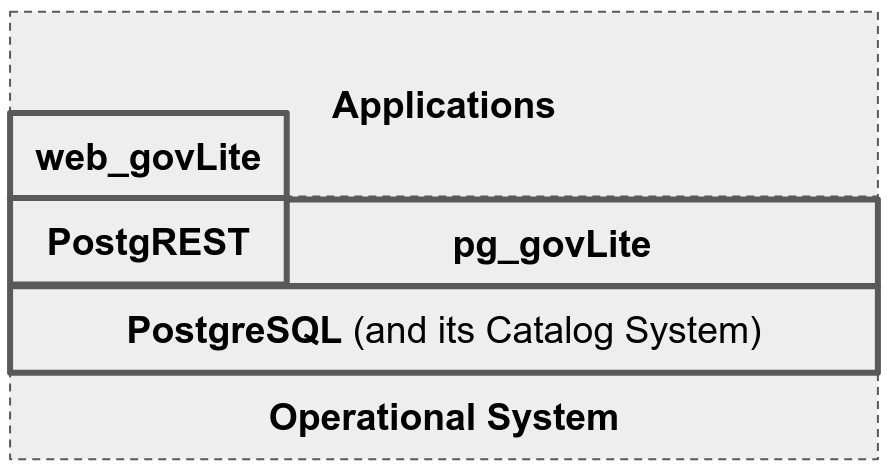
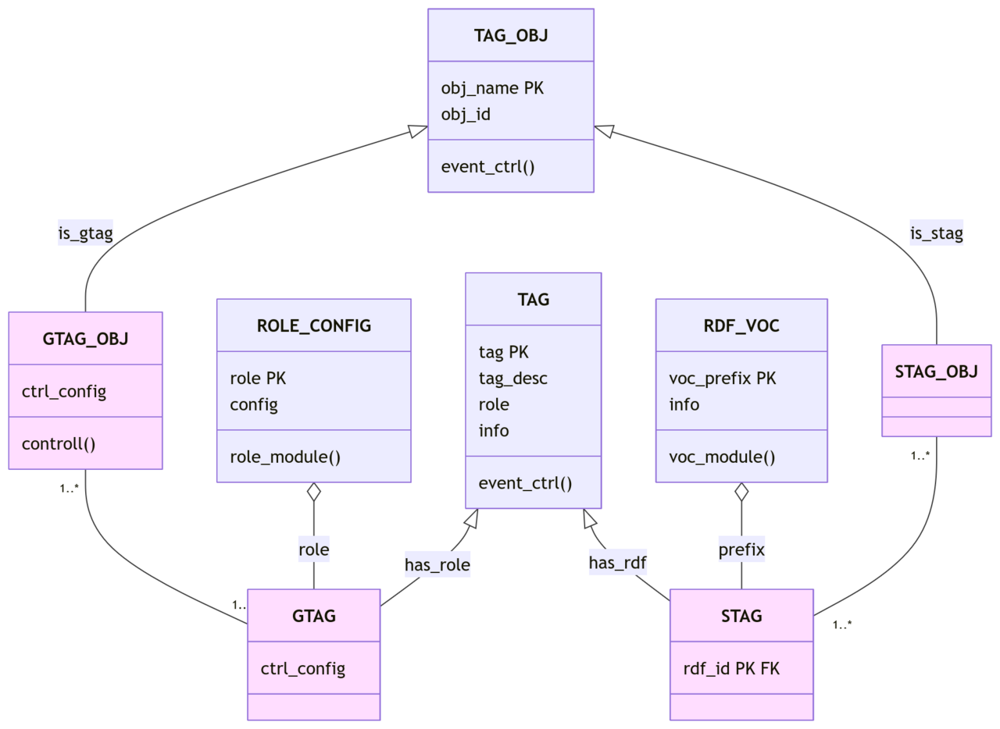

**pg_govLite** is designed to perform basic data governance tasks in metadata management, complementing [System Catalogs](https://www.postgresql.org/docs/current/catalogs.html) and acting as a unified metadata store. It manages the Medallion architecture and *tags* for all data objects (columns, tables, schemas, functions, etc.), with [RDF](https://en.wikipedia.org/wiki/Resource_Description_Framework) semantic tags, and [governed tags](https://docs.databricks.com/aws/en/admin/governed-tags/).

## Objectives
Adopt [Convention over Configuration](https://en.wikipedia.org/wiki/Convention_over_configuration) (CoC) principle for the basic metadata definition and maintenance tasks:

* Semantic tags and control tags;
* Medallion control of data objects (datasets and its part-whole hierarchy), like input/output and intermediary datasets;
* Data tier controls the identity-service and activation of data-quality services. See also "relevance driver" (business, regulatory, analytics, or operational)
* To generate human-readable structures System Catalog as standard structured content, for documentation.

All modules are external implementations, for example data quality is DQX, Secure control is external ABAC, etc. The pg_govLite is a central orchestration of modules by tags and triggers.

## Documentation
See .. PDFs. UML class:

Documentation helper scripts are also included in `src`:

* `src/doc01-UDF-mediawiki.sql` generates MediaWiki documentation for PostgreSQL UDFs.
* `src/inst04-documentation_examples.sql` installs executable documentation examples as views in `gvlt_doc_examples`, exposes function-example dependencies, and supports secondary example marking. Usage examples are available in `src/inst04-documentation_examples.md`.

## Install or test

This project foresees installation on Linux, using `make` command.

* `make` show all options.
* `make all` will install all in your database (edit Makefile to set your configurations). Standard installation.
* `make dropDbTest` will DROP the test-database and install all in it. Important for developers, to avoid [Software regression](https://en.wikipedia.org/wiki/Software_regression).
